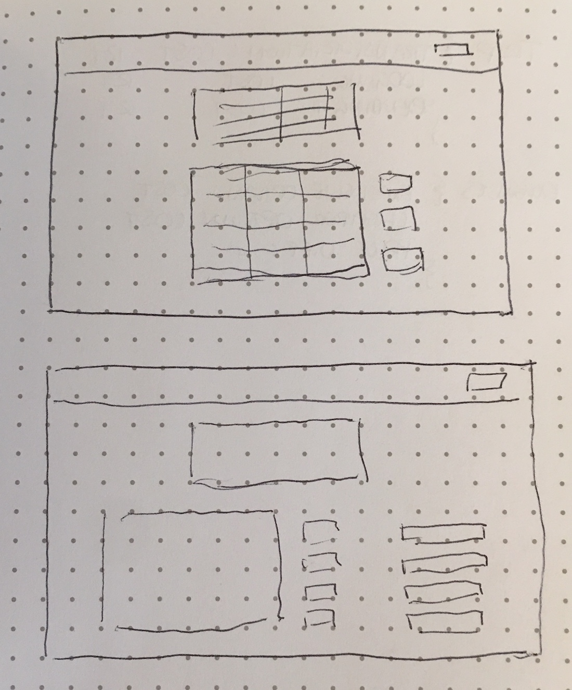

# Packing Up Pennies
##### By Eliza Davis

### Packing Up Pennies is an application for users to plan vacation budgets. Users may create trips with costs divided between transportation, lodging, and other expenses. They may edit and delete their trips as they wish.

### User Stories
- As a unregistered user, I would like to sign up with email and password.
- As a registered user, I would like to sign in with email and password.
- As a signed in user, I would like to change my password.
- As a signed in user, I would like to sign out.
- As a signed in user, I would like to create trips.
- As a signed in user, I would like to view all my trips or a single trip.
- As a signed in user, I would like to update my trips.
- As a signed in user, I would like to delete my trips.

### Technologies Used
- JavaScript
- JSX
- React
- React Bootstrap
- MongoDB & Mongoose
- Node.js
- Express.js
- Axios
- React Router

### Initial Planning, Development Process, Future Goals

My original goal for this project was to include a second resource, "expenses," and use the data from this to tally up a user's savings. The idea is that users input higher and lower priced options in their day-to-day spending, their respective costs, and the calculated difference would be applied as savings for their trip when they make the thriftier choice. As I am just beginning to get a grasp on the technologies used in this project, I hope to improve upon this app over time and get it to my original plan.

##### Back End Schedule:
1. Test CRUD for authorization.
2. Create collection for trips, build model and routes.
  1. CRUD and test trips.
3. Create collection for expenses, build model and routes.
  1. CRUD and test expenses.

##### Front End Schedule:
1. Create shared Layout Component.
2. Create Components for Expenses, Expense, ExpenseCreate.
3. Create Components for Trips, Trip, TripCreate, TripForm.
4. Add Routes for Components in App.js and add links to Header.
5. CRUD testing.

[Front and Back End deployed sites]

[Back end](https://shrouded-journey-68413.herokuapp.com)

[Front end](https://elizadavis.github.io/PackingUpPenniesClient)

[Front End Repository](https://github.com/elizadavis/PackingUpPenniesClient)

[Back End Repository](https://github.com/elizadavis/PackingUpPenniesAPI)

Wireframe:

